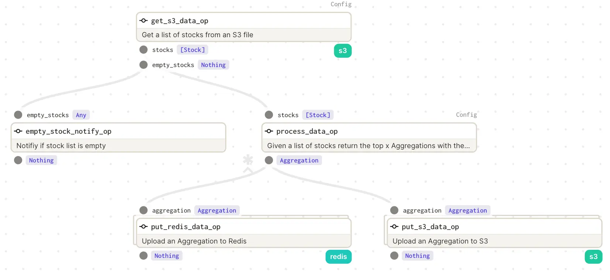

# Project 1 (Extended Challenge - OPTIONAL)

## Week 1 Challenge 
### OPTIONAL
If you have finished this week's project and are looking to build more with Dagster feel free to try this challenge problem. It is recommended you finish this week's problems first before trying the challenge problem. These challenges are not required to complete the certificate.

## Overview
This will be a slightly modified version of the week one project. To keep it separate from your week one project that we will build on next week, we will be working in the file week_1/challenge/week_1_challenge.py.

## Requirements

### get_s3_data


First we will change the get_s3_data op to include conditional branching. The list of Stocks should still go to the process_data op. However if the list of Stocks is empty, we should not invoke the process_data op, instead we should branch off to the empty_stock_notify op which will just log that the result is empty.

### process_data

Another change we will want to make. Instead of returning the single highest high, your op needs to take in a config schema value nlargest as an int, and return the n highest highs from a given list of Stocks. Using our example from earlier:

```
[
    Stock(date=datetime(2022, 1, 1, 0, 0), close=7.0, volume=12, open=7.0, high=10.0, low=6.0),
    Stock(date=datetime(2022, 1, 2, 0, 0), close=6.0, volume=14, open=8.0, high=11.0, low=5.0),
    Stock(date=datetime(2022, 2, 1, 0, 0), close=9.0, volume=13, open=9.0, high=15.0, low=5.0),
    Stock(date=datetime(2022, 2, 2, 0, 0), close=9.0, volume=16, open=9.0, high=12.0, low=6.0)
]
```

If the config schema for nlargest was set to 2, we would expect the aggregations to be returned as:

```
Aggregation(date=datetime(2022, 2, 1, 0, 0), high=15.0
Aggregation(date=datetime(2022, 2, 2, 0, 0), high=12.0
```

We will also change the output of the op to be dynamic. It will still return an Aggregation but it will be a dynamic output based on our nlargest value. Asking for the five largest stock highs would lead to five Aggregations.

### week_1_challenge

Since we are changing our pipeline to include a conditional and handle a dynamic output we will need to make a change to the job.



## Testing
To test your challenge problem, use the Makefile and run make week_1_challenge_tests. This will run the tests for the week one project (to ensure those are still working) as well as the tests for the challenge problem.

After your tests pass you can play around with your pipeline in Dagit. Try setting the nlargest to different values to see how the pipeline behaves. You may notice that when nlargest is set to higher values, the op executions seem to bunch together during execution. Why might that be? We will cover this in detail in the last week of class. 