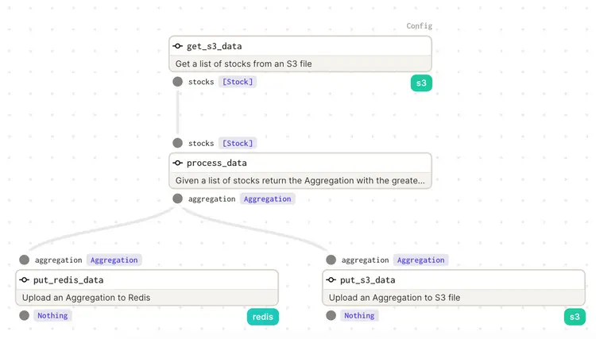

# Project 1 (Core Project)

## Overview
We will start building the pipeline that will be the foundation for the rest of the class. Each week will add in complexity and new Dagster abstractions. Eventually this pipeline will be something that would satisfy the initial request and be something we could safely run in production.

As a reminder we are the new hire at CTX and we need to implement a solution to read data from S3, perform some data processing, and then write the results to Redis and back to S3. In this first week, we will approximate interacting with S3 and Redis. We will cover actually working with external systems in week two.

##Requirements##
Your assignment is to finish the pipeline in week_1/project/week_1.py. The custom data types are provided (as well as a helper function we will use to emulate S3 which will just be a local file for now).

```
@usable_as_dagster_type(description="Stock data")
class Stock(BaseModel):
    date: datetime
    close: float
    volume: int
    open: float
    high: float
    low: float

@usable_as_dagster_type(description="Aggregation of stock data")
class Aggregation(BaseModel):
    date: datetime
    high: float
```

### USING PYDANTIC TYPES
Working with a pydantic data type is similar to most other data types in Python. We can initialize a new Aggregation as follows:

```
my_agg = Aggregation(day=datetime(2020, 1, 1), high=10.0)
```

The important thing is that the properties are the expected date types. Once this is initialized, you can easily access elements within.

```
> my_agg.high
10.0
> my_agg.day
datetime.datetime(2020, 1, 1)
> my_agg.day.month
1
```

## Ops
The focus will on creating and chaining the ops for this jobs. In total there are 3 ops:


### get_s3_data

This op will bring in data and process it into our custom data type. Since this is the first op in our DAG the input will not be from another op but will be provided via the config_schema. This config schema will take in one parameter, a string name s3_key. The output of the op is a list of Stock.

For week 1 we want the focus to be on the specifics of Dagster so a helper function provider csv_helper which takes in a file name and yields a generator of Stock using the class method for our custom data type.

### process_data

This op will require the output of the get_s3_data (which will be a list of Stock). The output of the process_data will be our custom type Aggregation

The processing occurring within the op will take the list of stocks and determine the Stock with the greatest high value. For example, if our incoming stocks looked like this:

```
[
    Stock(date=datetime(2022, 1, 1, 0, 0), close=7.0, volume=12, open=7.0, high=10.0, low=6.0),
    Stock(date=datetime(2022, 1, 2, 0, 0), close=6.0, volume=14, open=8.0, high=11.0, low=5.0),
    Stock(date=datetime(2022, 2, 1, 0, 0), close=9.0, volume=13, open=9.0, high=15.0, low=5.0),
    Stock(date=datetime(2022, 2, 2, 0, 0), close=9.0, volume=16, open=9.0, high=12.0, low=6.0)
]
```

We would expect the output to be:

```
Aggregation(date=datetime(2022, 2, 1, 0, 0), high=15.0)
```
You can use whatever you want to find this value. Don't be overly concerned with doing anything fancy, keep this simple.

### put_redis_data

For now, this op will be doing very little (it is fine if the function body remains just pass). However, it will need to accept the Aggregation type from your process_data op.

### week_1_pipeline

The job you are provided is empty. You will be responsible for chaining the ops together so that they execute in the correct order and correctly pass their outputs. All together, this will be a linear pipeline that looks like the following:



#### NAMING
Please do not rename any of the ops, custom types or jobs in the project. The associated tests assume that they are named a certain way and are located in the correct directory.

## Running your pipeline
There are several ways to interact with your code and check to see if it's working as you would expect.

### Testing
The quickest way to ensure your code is running as expected is to run the unit tests. To run the tests, from the root of the repo run the following command:

```
make week_1_tests
```

This will use the pytest framework to execute all the tests associated with the week one run project. Not all the tests will pass at first, and the goal is to see each individual test pass. Based on the name of the test that is failing, you can get a sense of where there is an issue. Here, the test_process_data test failed, so there is a problem with the process_data op (and since an op is failing, our overall pipeline test test_job is failing as well).

#### OTHER EXECUTION METHODS
It is not recommended to try the other options of running your pipeline until your job passes tests.

### Execute in Dagit
Another option is to execute your code via Dagit. Dagit is the web based UI for Dagster that allows you to interact with your pipelines. We will get into much more detail with Dagit later, but for now, you can use it to test our your ops.

```
dagit -f week_1/project/week_1.py 
```

A process will begin, and you will be able to execute job with the Dagit UI by visiting the URL it is being served on. (By default, this should be http://127.0.0.1:3000/). Here, you will find our code visualized, and you'll be able to launch runs.

Remember that you will need to provide the config to run the job.

```
ops:
  get_s3_data_op:
    config:
      s3_key: week_1/data/stock.csv
```

You can use this config to run you pipeline within the Launch pad.


#### FINISH
You will know that you have completed the project when all the tests pass. Feel free to try running your pipeline in different modes and start to get a feel for the Dagster service which we will talk about in much more detail next week.