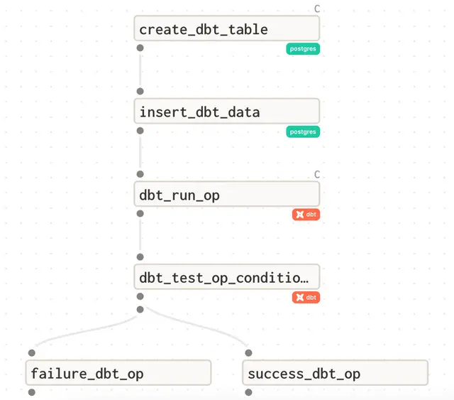

# Project 2 (Extended Challenge- OPTIONAL)

## Week 2 Challenge
#### OPTIONAL
If you have finished this week's project and are looking to build more with Dagster feel free to try this challenge problem. It is recommended you finish this week's problems first before trying the challenge problem. These challenges are not required to complete the certificate.

### Overview
For this week’s challenge we are going to incorporate dbt into a pipeline. Included in the root  directory is a very basic dbt project consisting of two models and a few tests.

#### DBT
dbt is an open source framework for creating and maintaining SQL models. There is quick  module included on dbt but if you would like to know more, CoRise also offers a great class on it.

You will not be responsible for making any changes to the dbt project (though you are free to experiment with it after you get your pipeline running). Instead we will focus on treating dbt like a resource. dbt is slightly different from the other resources we have interacted with so far since there are three different ways to interact with a dbt project: cli, rpc and cloud. For this challenge problem we are going to use the cli and colocate our dbt project code with our Dagster project code.



### Requirements
The goal of this challenge is to successfully incorporate dbt into a pipeline. We are going to leverage some of the etl pipeline from the content section for week two and the postgres resource we have already defined.

You are provided with two ops which will populate the base table needed for our dbt project. These steps will be followed by two dbt ops, one to execute a dbt run and one to execute dbt tests. Finally an op(s) that logs if the run was successful or not. We will want to reach this final op even if there is a dbt related issue in our pipeline.

There is a job configuration for Docker provided that is pointing to the provided dbt project. It is configured to use the Dagster maintained dbt resource but you have to decide how to implement the dbt ops and the success/failure op. For the dbt obs you have choices:

Use the Dagster provided dbt_resource_cli and create your own ops

Use the Dagster provided dbt ops

#### DBT ASSETS
If you have been following Dagster recently you may have heard about turning your dbt project into software defined assets. For now we are just using Dagster to execute a run of dbt, not generate assets. We will cover turning this dbt project into assets in week four when we cover software defined assets in detail.

The easiest way to run dbt would be to use the Dagster supported ops however you may have to be creative in how to do the conditional output. If you choose to create your own ops you will have more control on how to handle outputs but will lose some of the features of the Dagster maintained ops.

#### IGNORE_HANDLED_ERROR
If you look at the resource configuration for dbt you will see ignore_handled_error is set to True. This configuration in the Dagster dbt resource handles any errors that happen when you use a dbt command. For example executing dbt run with a failing model will not be marked as an error.

```
        "dbt": {
            "config": {
                "project_dir": DBT_PROJECT_PATH,
                "profiles_dir": DBT_PROJECT_PATH,
                "ignore_handled_error": True,
                "target": "test",
            },
        }
```

This can be very helpful if you have hundreds of models and tests and want your pipeline to continue even if there is a dbt issue.

## Testing
Because you have options on how to execute dbt with this pipeline there are no additional tests. 