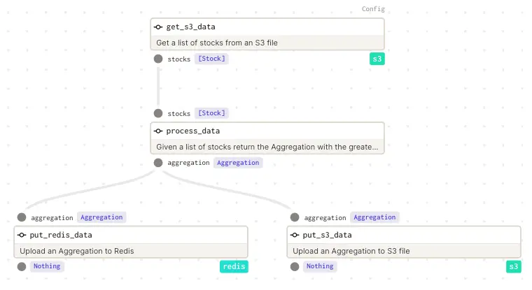
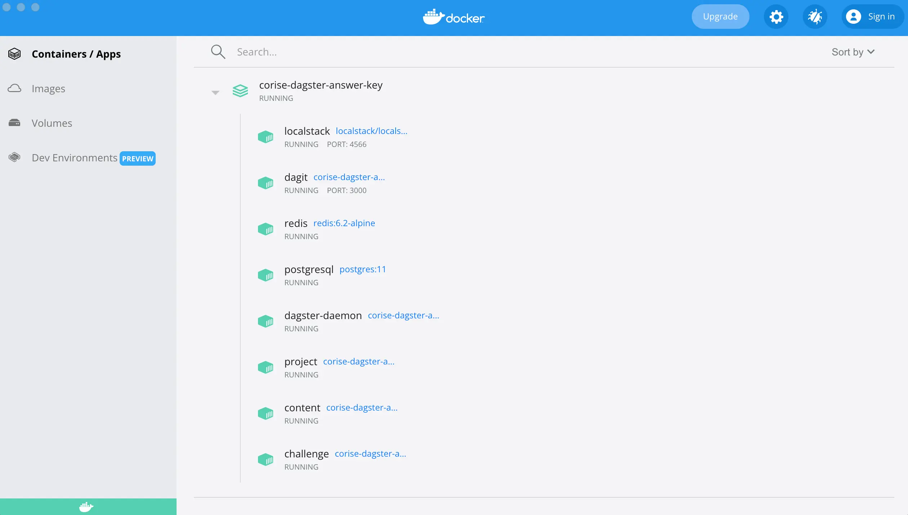
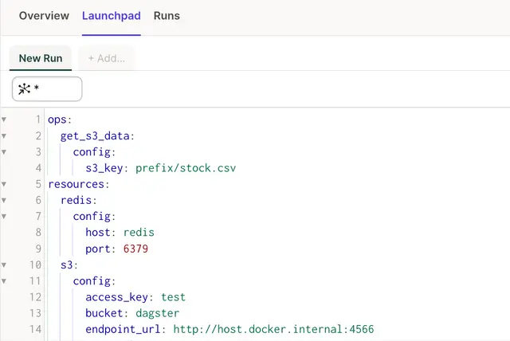

# Project 2 (Core Project)

## Week 2

```
week_2
├── dagster.yaml
├── data
│   └── stock.csv
├── local_stack.sh
├── tests
|   └── ...
├── workspace.yaml
└── workspaces
    ├── __init__.py
    ├── challenge
    │   └── ...
    ├── content
    │   └── ...
    ├── project
    │   └── ...
    ├── resources.py
    └── types.py
```
The directory for this week contains the following:

### Directories

+ workspaces: Contains the code for our Dagster code locations this include separate directories for the content, project and challenge.

+ data: Any data files we use for the project

+ tests: The tests for the project that we will use to determine if things are working as expected

### Files

+ local_stack.sh: Contains configuration settings for our localstack AWS instance.

+ workspace.yaml and dagster.yaml: Dagster specific configuration settings for our Dagster project

## Makefile Commands
This week you can run the following commands in the command line using the Makefile to help:

+ week_2_tests: Run the tests associated with week two

+ week_2_start: Start the Docker compose project detached in the background

+ week_2_down: Stop all the containers for the Docker compose project

+ restart_content: Restart the Docker container running the content workspace. This can be helpful when your Docker compose is running, and you've made a change to the content workspace that you would like to be applied.

+ restart_project: Restart the Docker container running the project workspace.

+ restart_challenge: Restart the Docker container running the project workspace.

## Resources
In the first week, we built the scaffolding of the project needed for CTX. As a reminder we need to pull data from S3, process it and send it to Redis and S3. However last week mocked out all of our connections. Now we haves to communicate with these external system where the data lives. Luckily we understand how resources fit into Dagster and can focus on tweaking our existing code to make this happen.

You will find that we can reuse most of the work from the first week. In fact our processing op can remain exactly the same. Since we are passing custom data types across our ops, we can ensure the interfaces between steps. Let's talk about what we need to do to update our S3 and Redis ops.

### Requirements
Like the previous week, you will be provided a partially completed pipeline. You will need to finish the resources and incorporate them into the ops. You will need to modify two files to finish this.

#### week_2/workspaces/resources.py (resources)
This file contains all our resource definitions that we use for week two. We have already talked about the Postgres resource during the lecture. As a reminder, a resource in Dagster is usually a wrapper for a client. We will need two clients, one for S3 and one for Redis. Those clients will need to provide the functionality we need to interact with our external systems. So the S3 client will need to read and write the contents of a file in S3 and the Redis client will need to be able to write to a Redis cache.

+ s3_resource

+ redis_resource

To keep things simple, the clients are provided, but you will need to turn those clients into resources. The configurations will be the most important part of creating the resources. What information do we need to pass to the client in order for it to initialize successfully? This is dictated by client. 

#### POSTGRES EXAMPLE
It can be helpful to look at the finished Postgres client and resource as you are finishing your S3 and Redis resource.

#### week_2/workspaces/project/week_2.py (ops and job)
After you have finished your resources, you can incorporate them into the get_s3_data and put_redis_data and put_s3_data ops.

+ get_s3_data

This op reads a file from S3 (provided as a config schema) and converts the contents into a list of our custom data type Stock. Last week we used the csv module to read the contents of a local file and return an iterator. We will replace that functionality with our S3 resource and use the S3 client method get_data to read the contents a file from remote storage (in this case our localstack version of S3 within Docker).

+ put_redis_data

This op relies on the redis_resource. In week one, our op did not do anything besides accept the output from the processing app. Now we want to take that output (our Aggregation custom type) and upload it to Redis. Luckily, our wrapped Redis client has a method to do just that. If you look at the put_data method, it takes in a name and a value and uploads them to our cache. Our Aggregation types has two properties to it, a date and a high. The date should be the name and the high should be our value, but be careful because the put_data method expects those values as strings.

+ put_s3_data

This op also relies on the same S3 resource as get_s3_data. For the sake of this project we will use the same bucket so we can leverage the same configuration. As with the redis op we will take in the aggregation from and write to it into a file in S3. The key name for this file should not be set in a config (as it is with the get_s3_data op) but should be generated within the op itself.

+ week_2_pipeline

Our DAG will remain the same as last week (though with our one new op added this week put_s3_data). However, unlike last week when we implemented it as a job, this week, we will use a graph. This is because we will be configuring our graph for two separate executions of our pipeline, one for local execution and one for Docker. You can just copy over the contents of your week one job into the graph for this week.

After setting our DAG within the graph we will want to configure two different jobs. One that will use Docker and one that will not. 

```
machine_learning_job_local = machine_learning_graph.to_job(
    name="machine_learning_job_local",
)

machine_learning_job_docker = machine_learning_graph.to_job(
    name="machine_learning_job_docker",
)
```

There are two additional parameters you will need to set within the to_job method. First you need to provide a dictionary for the config. These will be the two configuration dictionaries directly above in the file (local and docker). You will also need to set a dictionary for the resource_defs parameter. The keys for this dictionary are set in the config dictionaries we just set (local and docker). The value for this dictionary will be our resources created in the week_2/workspaces/resources.py file. The key is using the correct resource for each service and environment.

If you need a hint, it may be useful to look at the to_job configuration for the ETL job in the content directory.



### Running your pipeline
There are several ways to interact with your pipeline to check if it's working as you would expect.

#### Testing
The quickest way to ensure your pipeline is running as expected is to run the unit tests. To run the tests, from the root of the repo run the following command:


`make week_2_tests`

This will use the pytest framework to execute all the tests associated with the week two. Not all the tests will pass at first, and the goal is to see each individual test pass.

### MOCKING VS DOCKER
All the tests are run using mocks rather than against the Docker instances. This is mostly done for speed and to improve the feedback loop of running the tests. You will still be able to execute your pipeline against the Docker resources later, but it's best to get the tests to pass first.

## Docker
Last week we ran everything within a virtual environment (or Gitpod). This helped manage our python dependencies such as Dagster, but this week we will want to run the full Dagster instance, which will require some additional resources. This time around, we will use Docker to run the full service.

#### PROJECT
We will use Docker to better showcase your project. You can still run the tests and complete the project using just the virtual environment (or Gitpod).

### Install Docker
You should have installed Docker as part of the getting started guide, but if you have not already, you can install docker in a number of ways depending on your OS. After it is installed you will want to start Docker.

#### GITPOD
If you are using your own virtual environment you will need to ensure that you have Docker installed and running. If you are running in Gitpod, you do not need to install Docker, just run the Docker commands.

### Docker Environment
From the root of the repo run the following to ensure Docker is up and running.

```
> docker ps
CONTAINER ID   IMAGE     COMMAND   CREATED   STATUS    PORTS     NAMES
```

Assuming you are not currently using Docker for anything else, we should not see any containers running.

To start the Dagster Docker project, you can use the Makefile included in root of the repo. This Makefile has some simple commands to make interacting with the project as easy as possible. To run our Docker project, run the following command.

```
> make week_2_start
```

This will start the Docker compose project in the background. If this is the first time you are starting the project, it may take a little while for all the images to download and build (in the future Docker will not need to rebuild anything so it should be much faster).

#### DOCKER COMMAND
Do not worry too much about the command itself, but if you are curious, the Makefile is running.

```
docker compose --env-file=week_2/.course_week --profile dagster up -d --build
```

This is the basic docker compose up command with a few extra flags set.

+ docker compose: The base Docker compose command

+ --env-file=week_2/.course_week: Pass in the environment variables associated with week 2

+ --profile dagster: Enable the Dagster services in the compose

+ -d: Run detached.

+ --build: Build the associated images if they do not exist.

Eventually the terminal should show all the containers have started.

```
[+] Running 9/9
 ⠿ Network dagster_network   Created                                                                                                                                                                                                                                                  0.1s
 ⠿ Container postgresql      Started                                                                                                                                                                                                                                                  3.0s
 ⠿ Container redis           Started                                                                                                                                                                                                                                                  2.9s
 ⠿ Container localstack      Started                                                                                                                                                                                                                                                  2.7s
 ⠿ Container dagster-daemon  Started                                                                                                                                                                                                                                                  9.9s
 ⠿ Container dagit           Started                                                                                                                                                                                                                                                 10.0s
 ⠿ Container content         Started                                                                                                                                                                                                                                                  8.7s
 ⠿ Container project         Started                                                                                                                                                                                                                                                  7.0s
 ⠿ Container challenge       Started
 ```

You can rerun the docker ps command from above to make sure all the containers are running successfully.

```
> docker ps
CONTAINER ID   IMAGE                                      COMMAND                  CREATED          STATUS                             PORTS                                             NAMES
63822fc1f93f   corise-dagster-answer-key_challenge        "dagster api grpc -h…"   33 seconds ago   Up 24 seconds                      4002/tcp                                          challenge
1936006e3c32   corise-dagster-answer-key_project          "dagster api grpc -h…"   33 seconds ago   Up 26 seconds                      4001/tcp                                          project
bd3240905181   corise-dagster-answer-key_content          "dagster api grpc -h…"   33 seconds ago   Up 24 seconds                      4000/tcp                                          content
a995913b678c   corise-dagster-answer-key_dagit            "dagit -h 0.0.0.0 --…"   33 seconds ago   Up 23 seconds                      0.0.0.0:3000->3000/tcp                            dagit
333a07e9771e   corise-dagster-answer-key_dagster-daemon   "dagster-daemon run"     33 seconds ago   Up 23 seconds                                                                        dagster-daemon
cfa71d4ea727   localstack/localstack                      "docker-entrypoint.sh"   34 seconds ago   Up 31 seconds (health: starting)   4510-4559/tcp, 5678/tcp, 0.0.0.0:4566->4566/tcp   localstack
5fcb42ce8a01   postgres:11                                "docker-entrypoint.s…"   34 seconds ago   Up 31 seconds                      5432/tcp                                          postgresql
e5a4393a4448   redis:6.2-alpine                           "docker-entrypoint.s…"   34 seconds ago   Up 31 seconds                      6379/tcp                                          redis
```

If you have Docker Desktop up you can also see a visual representation of all your containers running.





### Confirmation
After all the containers are running for the Dagster project, you can go to http://localhost:3000/, where Dagit is hosted. This will be the interface for your fully running Dagster Docker project.

If you want to stop your Dagster Docker project, you can use the Makefile to stop the containers by running make week_2_down. It is a good practice to stop the containers when you are not using Docker or working on the Dagster project.

### Dagster Docker Deployment
Now that we have talked about Docker, let's talk about how this relates to our week two project. There is a single graph for week two, but you will see two different jobs for it. One is machine_learning_job_docker and the other is machine_learning_job_docker. The jobs have noticeable differences between them in terms of configs and resources used. Let's talk about each individually.

+ machine_learning_job_local

The config for the local job is very similar to week one. The only setting we are providing is the config schema value required for the process_data op:

```
local = {
    "ops": {"get_s3_data": {"config": {"s3_key": "prefix/stock.csv"}}},
}
```

Looking at the job configuration, we are using that config and setting our resource definitions to use the mock versions of the resources. For testing, Dagster supplies a useful helper in ResourceDefinition.mock_resource() which can be used to mock a resource we need to work with. This is very helpful for local runs and writing tests.

```
machine_learning_job_local = machine_learning_graph.to_job(
    name="machine_learning_job_local",
    config=local,
    resource_defs={
        "s3": mock_s3_resource,
        "redis": ResourceDefinition.mock_resource(),
    },
)
```

#### MOCK_S3_RESOURCE
You might notice that for the local configuration the S3 resource is mock_s3_resource rather than the more general ResourceDefinition.mock_resource() used by Redis. The reason for this is that the S3 mocked resource needs a return value (stocks) in order to execute successfully. The Redis resource mocks interacting with Redis but does not need a return value to provide further down the pipeline, so it can use the more generalized mock.

+ machine_learning_job_docker

The Docker job configuration is slightly more complicated. Let's look at the config:

```
docker = {
    "resources": {
        "s3": {
            "config": {
                "bucket": "dagster",
                "access_key": "test",
                "secret_key": "test",
                "endpoint_url": "http://host.docker.internal:4566",
            }
        },
        "redis": {
            "config": {
                "host": "redis",
                "port": 6379,
            }
        },
    },
    "ops": {"get_s3_data": {"config": {"s3_key": "preifx/stock.csv"}}},
}
```

There is a lot more here compared to the local config. We can still see the op level config for process_data, but we now also have resources in the configuration for both S3 and Redis. This makes sense. Before in our local configuration we were not interacting with other systems, so we did not need to pass in connection information. In Docker, however, we actually need to connect to S3 and Redis and provide things like the host and any authentication information we might need. In our job configuration we will need to supply the config and resource_defs. When you're in Dagit if you bring up launch pad for the machine_learning_job_docker you will see your configuration value set.




You will want to ensure that the configuration is set when you execute a run of the pipeline.

#### POSSIBLE ERROR
If you run the Docker pipeline and it fails with the error.

```
botocore.errorfactory.NoSuchKey: An error occurred (NoSuchKey) when calling the GetObject operation: The specified key does not exist.
```
Make sure you have the config schema set for your run. If this isn't set the pipeline will not know where to look for the S3 file.

#### FINISH
You will know that you have completed the project when all the tests pass. Feel free to try running your pipeline in different modes (local and docker).

#### GITPOD PORTS
If running in Gitpod and you cannot access Dagit at localhost:3000 you may need to expose the port in Gitpod

```
gp url 3000
```

## Summary
While in the Docker environment, if you run the jobs for machine_learning_job_local or machine_learning_job_docker, they will seem to execute the same. This is extremely powerful and will make more sense as we talk more about making our Dagster project production-ready later in the class. Being able to run our pipeline on two entirely different infrastructures without changing the actual pipeline code is very exciting and opens up a lot of possibilities when designing data applications! 